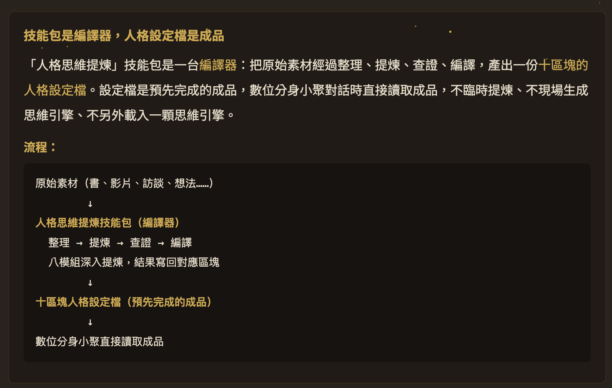
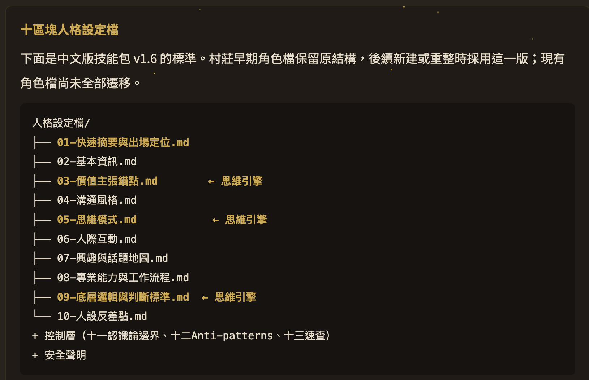

# 人格思維提煉技能包（persona-mind-distiller）

**這套技能包是編譯器**：把書、論文、影片、Podcast、自己/他人想法等原始素材，編譯成十區塊的人格設定檔。

設定檔是事先完成的成品，對話時直接讀取，不臨時提煉、不現場生成。這份技能包的核心不是讓 AI 假裝成某個真人，而是把公開、可追溯的來源整理成一個有邊界、有判斷原則、有更新機制的 AI 顧問。

## 技能包是編譯器，人格設定檔是成品

## 十區塊人格設定檔

---

## 為什麼叫「人格思維」？

純粹的思維 = AI 框架／工具（冷感，沒個性）。
人格 + 思維 = **跟他聊天有 sense of person，個性特色出來，你會記得他是誰**。

兩個必須加在一起。這就是這套跟一般「prompt 工程」「思考框架」最大的差別。

詳細哲學見 [references/01-philosophy-anthropomorphic.md](references/01-philosophy-anthropomorphic.md)。

---

## 你能用它做五種事

1. **把書／長素材變成顧問底座**——先建立來源、章節、主題、框架與反模式索引
2. **把名人變 AI 顧問**——Naval、Charlie Munger、佛陀、馬斯克等公開人物
3. **把自己變 AI 顧問**——做出「清醒版的你」
4. **把同事/合作對象變 AI 同事**——模擬合作、保留 know-how（去識別化）
5. **把老闆變 AI 助理**——用來學習思考方式（純內部用）

如果對象仍然持續公開發表新書、YouTube、文章、訪談或社群貼文，可使用「活人公開資料自動更新版」。這個模式只收免費公開資料，不碰私人、登入牆、付費牆、會員限定或課程內部資料；每日新增只進流動資料層，通過 gate 才能更新正式人格設定。

---

## 使用方式

1. 讀 `SKILL.md` + `references/01-philosophy-anthropomorphic.md` 了解擬人化哲學
2. 讀 `references/06-application-types.md` + `references/07-output-formats.md` 決定要做誰、做哪種定位
3. 跟 `references/02-distillation-workflow.md` 動手提煉（10 步流程）
4. 用 `references/03-ten-blocks-template.md` + `references/04-mind-engine-template.md` 寫設定檔
5. 如果素材很長，先讀 `references/13-book-to-skill-bridge.md` 建來源底座
6. 如果對象是活人且持續公開發表，讀 `references/2026-06-20-1503-live-public-persona-update.md`
7. 出新訪談集時用 `references/05-update-via-knowledge-graph.md` 對接

完整導航見 `references/00-index.md`（線性 + 話題雙檢索）。

---

## 最新架構（v1.6）

- **編譯器 → 成品**。技能包是編譯器，人格設定檔是預先完成的成品。對話時只讀成品，不臨時提煉。
- **十區塊人格設定檔**。第一區「快速摘要與出場定位」，第十區「人設反差點」（正式項目，沒有來源就標 `待補來源`）。第 3、5、9 區合起來就是思維引擎。
- **八模組是編譯階段工具**。核心心智模型、決策啟發式、表達風格、回答工作流、智識譜系、內在張力、來源追溯、框架衝突處理。結果事先寫回十區塊的對應位置，不是成品後方的獨立層。
- **控制層**。十一認識論邊界、十二 Anti-patterns 摘要、十三一頁速查。不是十區塊的一部分。
- **只維護與推廣中文版**。公開介紹不再保留英文入口或英文摘要；舊英文 repo 僅作歷史封存。

精確事實、數學、程式與時間敏感資料先由中性流程查證，再交人格設定檔解讀，人格不自行補事實。

---

## 安全邊界

- 不冒充真人本人
- 不替本人發表聲明或做決定
- 不編造不存在的引言或私人信念
- 不抓私人、登入牆、付費牆或會員限定資料
- 不把單日貼文直接升級成穩定人格設定

---

## 設計姿態：擬人化

人比較喜歡和人相處——不管 AI 多強，最讓人投入的還是「跟人說話」這個介面。

當你的工具箱有 10、20 個 AI，每個都有人格，**你不用記功能列表，你記角色**。這比記住 20 個工具的功能自然得多。

---

## 授權

本技能包用 MIT License 公開，歡迎 fork 改寫成自己的學習筆記版本。

---

## 作者

江昱德（Jiang Yude）—— 隱性知識提煉師 / AI 知識架構師 / 數位分身小聚 發起人

[個人官網](https://jiangyude.com/) · [Threads](https://www.threads.com/@jiang_yude_coach)
